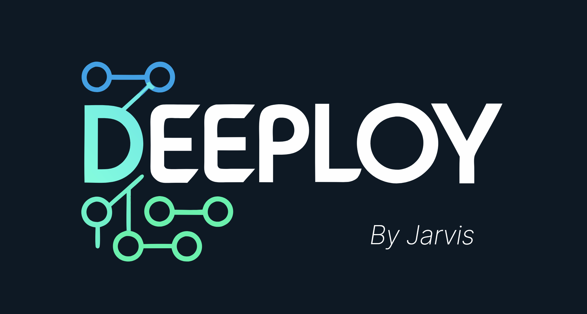
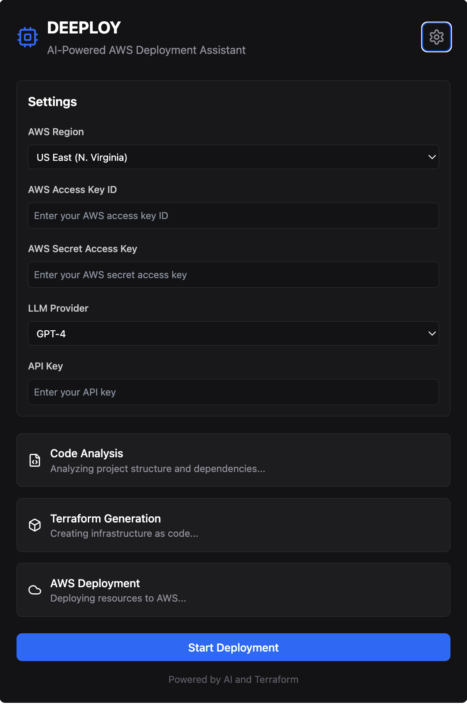
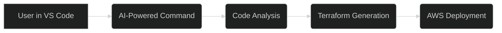

# 

<!-- https://claude.site/artifacts/f4b172dd-01bc-4782-a3cb-6e6d092808d0 -->

Show the ui link

https://claude.site/artifacts/9498e7e3-90c7-40bd-95cc-498e633cb45e

  

  <a href="#introduction">Introduction</a> |
  <a href="#vscode-extension-workflow">VS Code Extension Workflow</a> |
  <a href="#branches">Branches</a> |
  <a href="#roadmap-for-mvp-in-one-day">Roadmap</a> |
  <a href="#packages-to-consider">Packages</a> |
  <a href="#potential-complications">Complications</a> |
  <a href="#simplifications">Simplifications</a> |
  <a href="#missed-considerations">Missed Considerations</a> |
  <a href="#todo">TODO</a> |
  <a href="#mvp-scope">MVP Scope</a> |
  <a href="#features">Features</a>

## Mermaid Chart

## Introduction

This project is a VS Code extension designed to streamline the process of deploying applications to AWS using AI-powered Terraform script generation. It leverages large language models (LLMs) and other AI techniques to automate the creation of infrastructure as code, making it easier and faster to deploy applications to AWS.

## VS Code Extension Workflow

The core of this project is a VS Code extension that provides a seamless workflow for deploying to AWS using AI-generated Terraform scripts. Here's how it works:

1.  **User Initiates Command:** The user triggers the AI-powered deployment command within VS Code.
2.  **Code Analysis:** The extension analyzes the user's project, summarizing the purpose of each file and identifying key components.
3.  **Terraform Generation:** The extension uses an LLM to generate a Terraform template based on the code analysis.
4.  **AWS Deployment:** The extension deploys the generated Terraform template to AWS, creating the necessary infrastructure.

This workflow automates the entire process of creating infrastructure as code and deploying it to AWS, all within the VS Code environment.

## Branches

### `master`
- Base branch with no specific code changes.

### `code-expert-llm`
- Introduces a `CodeAnalysisAgent` class for summarizing code files and identifying interactions between files.
- Uses a Hugging Face language model for summarization.

### `debug`
- Identical to `code-expert-llm` and doesn't contain any code changes.

### `integration`
- Integrates the `CodeAnalysisAgent` with a `TerraformTemplateGenerator` in an `AIPipeline`.
- Includes a hardcoded path to a project directory and API keys.

### `integration-path-fix`
- Minor fix to the `integration` branch, adding an `__init__.py` file to the `pipeline` directory.

### `rag_dev`
- Introduces a `DocsCrawler` class for scraping documentation from URLs, generating embeddings, and storing them in a Pinecone index.
- Uses `Crawl4aiTools` for web scraping, `SentenceTransformer` for generating embeddings, and `Pinecone` for storing embeddings.

### `terrform-gen-expert`
- Includes a `TerraformTemplateGenerator` class that generates Terraform templates based on code file summaries.
- Includes an `extract-files.py` script that uses an LLM to identify necessary files for infrastructure deployment.

### `vscode_ext`
- Introduces a VS Code extension that lists all files in the currently opened workspace folder.
- Uses the VS Code API for interacting with the editor.

## Roadmap for MVP in One Day

**Goal:** To achieve a functional MVP of the VS Code extension that can analyze code, generate Terraform scripts, and deploy to AWS.

**Assumptions:**

-   We have a basic understanding of the code in each branch.
-   We have access to necessary API keys and credentials.
-   We are working with a team of developers.

**Phases:**

1.  **Morning (9:00 AM - 12:00 PM): Core Functionality Integration**

    *   **Code Analysis (`code-expert-llm`):**
        *   **Task:** Integrate the `CodeAnalysisAgent` into the VS Code extension.
        *   **Simplification:** Focus on summarizing code files and skip the interaction analysis for now.
        *   **Packages:** Use `langchain` for text splitting and `transformers` for the LLM.
        *   **Considerations:** Ensure the model is loaded correctly and the summarization is working within the VS Code extension.
    *   **Terraform Template Generation (`terrform-gen-expert`):**
        *   **Task:** Integrate the `TerraformTemplateGenerator` into the VS Code extension.
        *   **Simplification:** Skip the AWS S3 push and focus on generating a basic template.
        *   **Packages:** Use `ollama` for the LLM.
        *   **Considerations:** Ensure the LLM is working and the template is generated correctly within the VS Code extension.
    *   **Combine:** Create a single VS Code command that analyzes the code and generates a Terraform template.

2.  **Afternoon (1:00 PM - 4:00 PM): Deployment and Basic UI**

    *   **AWS Deployment:**
        *   **Task:** Integrate the Terraform deployment process into the VS Code extension.
        *   **Simplification:** Focus on a basic deployment process without advanced configurations.
        *   **Packages:** Use the AWS SDK for Python (boto3) or the Terraform CLI.
        *   **Considerations:** Ensure the deployment process is working correctly within the VS Code extension.
    *   **Basic UI:**
        *   **Task:** Add basic UI elements to the VS Code extension for user interaction.
        *   **Simplification:** Focus on basic input prompts and output messages.
        *   **Packages:** Use the VS Code API.
        *   **Considerations:** Ensure the UI elements are working correctly and are user-friendly.

3.  **Late Afternoon (4:00 PM - 6:00 PM): Testing and Refinement**

    *   **Testing:**
        *   Test the VS Code extension with a sample project and AWS account.
    *   **Refinement:**
        *   Fix any bugs or issues that arise during testing.
        *   Make minor improvements to the code and UI.
        *   Write a basic README.md file.

## Packages to Consider

-   **`langchain`:** For text splitting and LLM integration.
-   **`transformers`:** For loading and using LLMs.
-   **`ollama`:** For interacting with local LLMs.
-   **`boto3`:** For interacting with AWS services.
-   **VS Code API:** For creating the VS Code extension.
-   **`litellm`:** Consider using `https://github.com/BerriAI/litellm` for easier LLM integration.

## Potential Complications

-   **API Keys and Credentials:** Ensure all API keys and credentials are set up correctly.
-   **Model Loading:** Ensure the LLMs are loaded correctly and are working as expected within the VS Code extension.
-   **File Paths:** Ensure all file paths are correct and the extension can access the necessary files.
-   **Error Handling:** Implement basic error handling to catch any issues that may arise.
-   **Integration Issues:** Ensure all components are integrated correctly and are working together within the VS Code extension.
-   **AWS Permissions:** Ensure the AWS account has the necessary permissions to deploy resources.

## Simplifications

-   Skip the interaction analysis in the `CodeAnalysisAgent`.
-   Skip the AWS S3 push in the `TerraformTemplateGenerator`.
-   Focus on a basic deployment process without advanced configurations.
-   Focus on basic UI elements for user interaction.

## Missed Considerations

-   **Error Handling:** The current code lacks proper error handling.
-   **Logging:** The current code lacks proper logging.
-   **Unit Tests:** The current code lacks unit tests.
-   **CI/CD:** The current code lacks a CI/CD pipeline.
-   **Security:** The current code hardcodes API keys and credentials.

## TODO

- [ ] Integrate `CodeAnalysisAgent` into the VS Code extension.
- [ ] Integrate `TerraformTemplateGenerator` into the VS Code extension.
- [ ] Implement basic AWS deployment functionality within the VS Code extension.
- [ ] Add basic UI elements for user interaction.
- [ ] Test the VS Code extension with a sample project and AWS account.
- [ ] Write a basic README.md file.

## MVP Scope

The MVP scope includes the following:

-   A VS Code extension that can analyze code, generate Terraform scripts, and deploy to AWS.
-   Basic UI elements for user interaction.
-   A basic deployment process without advanced configurations.

## Features

-   **AI-Powered Code Analysis:** Summarizes code files and identifies key components.
-   **Terraform Template Generation:** Generates Terraform templates based on code file summaries.
-   **AWS Deployment:** Deploys the generated Terraform template to AWS.
-   **VS Code Integration:** Provides a seamless workflow within the VS Code environment.
