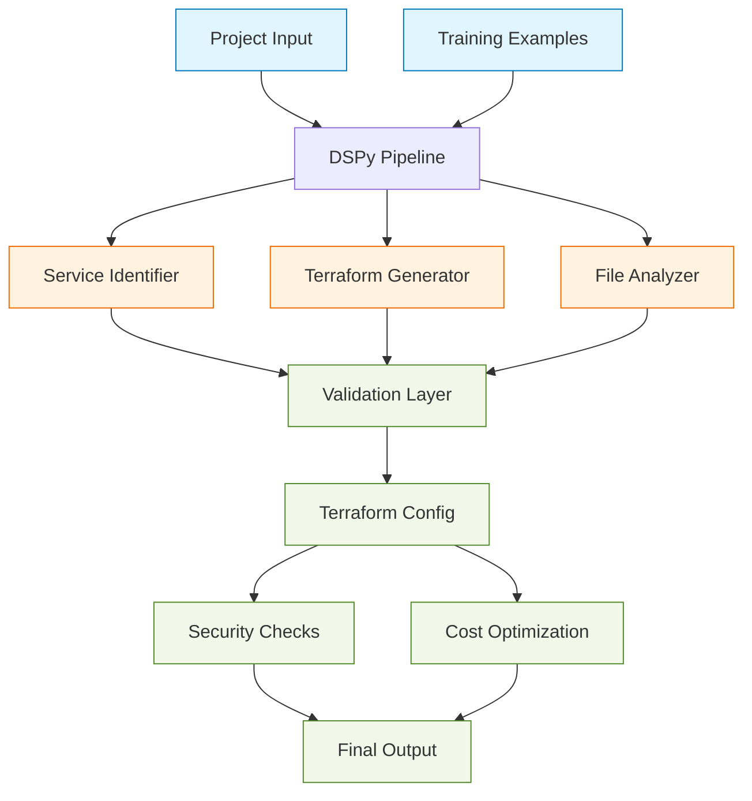

# DSPy-Enhanced Terraform Generator

## Overview
This project enhances infrastructure-as-code generation using DSPy's structured prediction framework. By leveraging few-shot learning and modular design principles, it provides more reliable and maintainable Terraform configuration generation.



## Key Improvements

### Enhanced Prediction Architecture
- Structured predictors using DSPy Signature classes:
  - `ServiceIdentifier` for AWS service detection
  - `TerraformGenerator` for infrastructure configuration
  - `FileAnalyzer` for project structure analysis
- Few-shot learning capabilities through bootstrapping mechanism
- Optimized API usage and token consumption

### Architectural Benefits
- Modular components that can be independently:
  - Trained
  - Evaluated
  - Enhanced with additional examples
- Clear separation of concerns
- Robust error handling and validation
- Comprehensive type hinting for improved maintainability

## Installation

1. Install required packages:
```bash
pip install dspy-ai python-dotenv
```

2. Configure environment variables:
```bash
OPENROUTER_API_KEY=your_key_here
```

3. Run the application:
```bash
python terraform_expert.py
```

## System Components

### Service Identification
- Analyzes project requirements
- Identifies necessary AWS services
- Provides confidence scores for selections

### Terraform Configuration Generation
- Produces infrastructure-as-code configurations
- Implements best practices
- Includes security considerations

### Project Analysis
- Examines project structure
- Determines resource dependencies
- Suggests optimization opportunities

## Development Benefits

### Improved Reliability
- Structured prediction replaces raw prompts
- Consistent output formatting
- Built-in validation mechanisms

### Enhanced Maintainability
- Clear module boundaries
- Type-safe interfaces
- Simplified testing approach

### Extensibility
- Easy addition of new capabilities via DSPy Signatures
- Performance improvement through example addition
- Flexible model configuration

## Future Improvements
- Additional training examples for enhanced accuracy
- New service support modules
- Extended validation capabilities
- Performance optimization options

